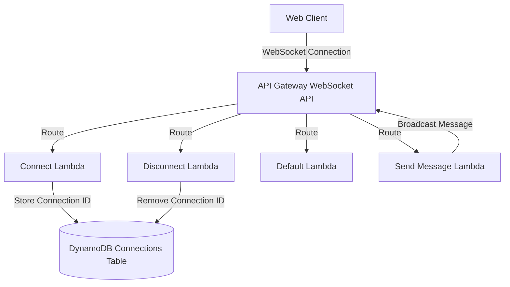
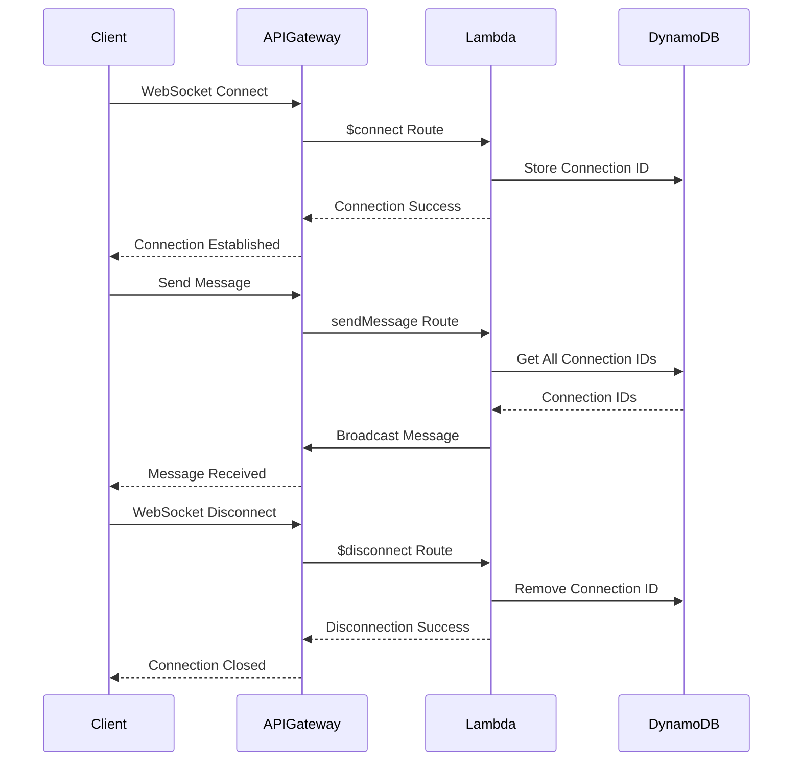

# AI Web Chat - Phase 1 Architecture (MVP)

## System Architecture Diagram



## Data Flow Diagram



## Execution Tasks

### 1. CDK Project Setup
- [x] Create new `cdk` directory
- [x] Initialize CDK project with TypeScript
- [x] Configure `cdk.json` with required settings
- [x] Set up TypeScript configuration
- [x] Create initial stack structure
- [x] Configure AWS credentials and region

### 2. API Gateway Setup
- [x] Create WebSocket API construct
- [x] Set up WebSocket routes:
  - [x] $connect
  - [x] $disconnect
  - [x] $default
  - [x] sendMessage
- [x] Set up route integrations with Lambda
- [x] Test API Gateway configuration

### 3. DynamoDB Setup
- [x] Create DynamoDB table construct
- [x] Configure table settings:
  - [x] Primary key: connectionId
- [x] Set up table permissions
- [x] Test table creation

### 4. Lambda Functions Setup
- [x] Create Lambda function constructs
- [x] Set up function configurations:
  - [x] Runtime
  - [x] Memory
  - [x] Timeout
- [x] Configure IAM roles and permissions
- [x] Set up function logging
- [x] Test function creation

### 5. Lambda Function Implementation
- [x] Implement $connect handler:
  - [x] Store connection ID
  - [x] Handle errors
- [x] Implement $disconnect handler:
  - [x] Remove connection ID
- [x] Implement $default handler:
  - [x] Log unhandled routes
- [x] Implement sendMessage handler:
  - [x] Get all connections
  - [x] Broadcast message
  - [x] Handle errors

### 6. IAM and Security Setup
- [x] Create IAM roles for Lambda
- [x] Set up basic permissions
- [x] Set up API Gateway permissions
- [x] Configure DynamoDB permissions
- [x] Test security configurations

### 7. Testing Setup
- [x] Set up WebSocket client for testing
- [x] Create basic test scripts
- [x] Test WebSocket connections
- [x] Test message broadcasting
- [x] Test disconnection handling

### 8. Deployment
- [x] Create deployment script
- [x] Configure environment variables
- [x] Deploy to development
- [x] Test deployment
- [x] Deploy to production

### 9. Documentation
- [x] Create basic API documentation
- [x] Document deployment process
- [x] Create simple troubleshooting guide

## Project Status

Phase 1 has been completed successfully. The basic WebSocket chat infrastructure is now in place with the following features:
- WebSocket API Gateway setup with all required routes
- DynamoDB table for connection management
- Lambda functions for handling connections, messages, and disconnections
- Basic security and IAM configurations
- Testing infrastructure
- Deployment pipeline

## Next Steps

Phase 2 implementation can now begin, focusing on:
1. Bedrock agent integration
2. S3 bucket setup for file storage
3. File upload functionality
4. Enhanced message handling with AI
5. Extended testing and documentation

## Dependencies

- AWS CDK
- TypeScript
- AWS SDK
- Node.js
- AWS CLI (configured with appropriate credentials)

## File Structure

```
webchat-aws/                      # Root directory (existing files preserved)
├── cdk/                         # New CDK project directory
│   ├── bin/                    # CDK app entry point
│   │   └── cdk.ts             # Main CDK app file
│   ├── lib/                    # Stack definitions
│   │   ├── websocket-stack.ts  # Main stack
│   │   └── constructs/        # Reusable constructs
│   │       ├── websocket-api.ts
│   │       └── lambda-functions.ts
│   ├── lambda/                 # Lambda function code
│   │   ├── connect/
│   │   │   └── index.ts
│   │   ├── disconnect/
│   │   │   └── index.ts
│   │   ├── default/
│   │   │   └── index.ts
│   │   └── sendMessage/
│   │       └── index.ts
│   ├── cdk.json               # CDK configuration
│   ├── package.json           # CDK project dependencies
│   └── tsconfig.json          # TypeScript configuration
├── AI web chat phase 1.md      # Existing architecture doc
└── README.md                   # Existing README
```

## CDK Project Setup Steps

1. **Create CDK Directory**
   ```bash
   mkdir cdk
   cd cdk
   ```

2. **Initialize CDK Project**
   ```bash
   cdk init app --language typescript
   ```

3. **Update CDK Configuration**
   - Modify `cdk.json` to include:
     ```json
     {
       "app": "npx ts-node --prefer-ts-exts bin/cdk.ts",
       "watch": {
         "include": [
           "**"
         ],
         "exclude": [
           "README.md",
           "cdk*.json",
           "**/*.d.ts",
           "**/*.js",
           "tsconfig.json",
           "package*.json",
           "yarn.lock",
           "node_modules",
           "test"
         ]
       },
       "context": {
         "@aws-cdk/aws-lambda:recognizeLayerVersion": true,
         "@aws-cdk/core:checkSecretUsage": true,
         "@aws-cdk/core:target-partitions": [
           "aws",
           "aws-cn"
         ],
         "@aws-cdk-containers/ecs-service-extensions:enableDefaultLogDriver": true,
         "@aws-cdk/aws-ec2:uniqueImdsv2TemplateName": true,
         "@aws-cdk/aws-ecs:arnFormatIncludesClusterName": true,
         "@aws-cdk/aws-iam:minimizePolicies": true,
         "@aws-cdk/core:validateSnapshotRemovalPolicy": true,
         "@aws-cdk/aws-codepipeline-actions:useNewDefaultBranchForCodeCommitSource": true,
         "@aws-cdk/aws-s3:createDefaultLoggingPolicy": true,
         "@aws-cdk/aws-sns-subscriptions:restrictSqsDescryption": true,
         "@aws-cdk/aws-apigateway:disableCloudWatchRole": true,
         "@aws-cdk/core:enablePartitionLiterals": true,
         "@aws-cdk/aws-events:eventsTargetQueueSseKeyId": true,
         "@aws-cdk/aws-iam:standardizedServicePrincipals": true,
         "@aws-cdk/aws-ecs:disableExplicitDeploymentControllerForCircuitBreaker": true,
         "@aws-cdk/aws-iam:importedRoleStackSafeDefaultPolicyName": true,
         "@aws-cdk/aws-s3:serverAccessLogsUseBucketPolicy": true,
         "@aws-cdk/aws-route53-patters:useFargateContainer": true,
         "@aws-cdk/customresources:installLatestAwsSdkDefault": false,
         "@aws-cdk/aws-rds:databaseProxyUniqueResourceName": true,
         "@aws-cdk/aws-codedeploy:removeAlarmsFromDeploymentGroup": true,
         "@aws-cdk/aws-apigateway:authorizerChangeDeploymentLogicalId": true,
         "@aws-cdk/aws-ec2:launchTemplateDefaultUserData": true,
         "@aws-cdk/aws-secretsmanager:useAttachedSecretResourcePolicyForSecretTargetAttachments": true,
         "@aws-cdk/aws-redshift:columnId": true,
         "@aws-cdk/aws-stepfunctions-tasks:enableEmrServicePolicyV2": true,
         "@aws-cdk/aws-ec2:restrictDefaultSecurityGroup": true,
         "@aws-cdk/aws-apigateway:requestValidatorUniqueId": true
       }
     }
     ```

4. **Update TypeScript Configuration**
   - Modify `tsconfig.json` to include:
     ```json
     {
       "compilerOptions": {
         "target": "ES2018",
         "module": "commonjs",
         "lib": ["es2018"],
         "declaration": true,
         "strict": true,
         "noImplicitAny": true,
         "strictNullChecks": true,
         "noImplicitThis": true,
         "alwaysStrict": true,
         "noUnusedLocals": false,
         "noUnusedParameters": false,
         "noImplicitReturns": true,
         "noFallthroughCasesInSwitch": false,
         "inlineSourceMap": true,
         "inlineSources": true,
         "experimentalDecorators": true,
         "strictPropertyInitialization": false,
         "typeRoots": ["./node_modules/@types"],
         "outDir": "dist"
       },
       "exclude": ["node_modules", "cdk.out"]
     }
     ```

5. **Create Lambda Function Structure**
   ```bash
   mkdir -p lambda/{connect,disconnect,default,sendMessage}
   touch lambda/{connect,disconnect,default,sendMessage}/index.ts
   ```

6. **Update Package.json**
   - Add required dependencies:
     ```json
     {
       "dependencies": {
         "aws-cdk-lib": "^2.0.0",
         "constructs": "^10.0.0",
         "@types/node": "^18.0.0",
         "typescript": "^4.9.0"
       }
     }
     ```

7. **Install Dependencies**
   ```bash
   npm install
   ```

This structure allows you to:
- Keep existing files in the root directory
- Organize CDK code separately
- Maintain clean separation of concerns
- Scale the project as needed
- Keep Lambda functions organized

## Next Steps

1. Initialize CDK project in the `cdk` directory
2. Implement basic infrastructure code
3. Create Lambda functions
4. Test the implementation
5. Deploy to AWS 