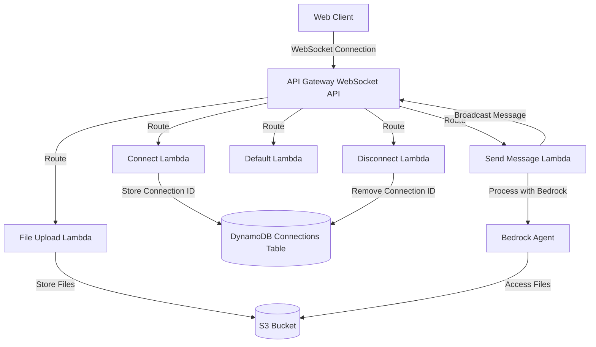
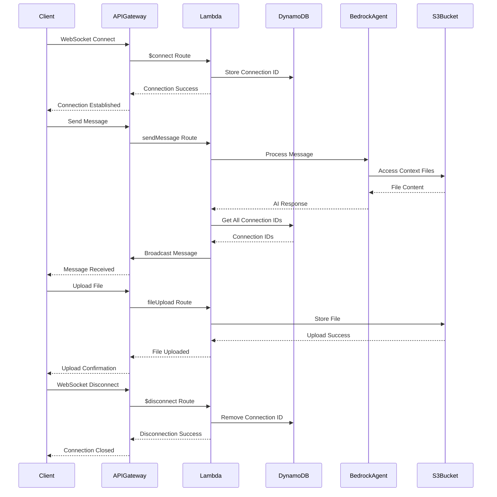

# AI Web Chat - Phase 2 Architecture (Bedrock Integration)

## System Architecture Diagram



## Data Flow Diagram



## Execution Tasks

### 1. Bedrock Agent Setup
- [ ] Create Bedrock agent with Nova model
- [ ] Configure agent parameters:
  - [ ] Temperature
  - [ ] Max tokens
  - [ ] Context window
- [ ] Set up agent permissions
- [ ] Test agent configuration

### 2. S3 Bucket Setup
- [ ] Create S3 bucket construct
- [ ] Configure bucket settings:
  - [ ] CORS configuration
  - [ ] Lifecycle policies
  - [ ] Encryption
- [ ] Set up bucket permissions
- [ ] Test bucket creation

### 3. File Upload Lambda Setup
- [ ] Create file upload Lambda function
- [ ] Configure function settings:
  - [ ] Memory allocation
  - [ ] Timeout
  - [ ] Environment variables
- [ ] Set up S3 permissions
- [ ] Test function creation

### 4. WebSocket API Updates
- [ ] Add file upload route
- [ ] Configure route integration
- [ ] Update API permissions
- [ ] Test new route

### 5. Message Handler Updates
- [ ] Modify sendMessage handler:
  - [ ] Add Bedrock integration
  - [ ] Handle AI responses
  - [ ] Manage context
- [ ] Update error handling
- [ ] Test message flow

### 6. IAM and Security Updates
- [ ] Create Bedrock access role
- [ ] Set up S3 access permissions
- [ ] Configure Lambda permissions
- [ ] Test security setup

### 7. Client Updates
- [ ] Add file upload UI
- [ ] Implement file handling
- [ ] Update message display
- [ ] Test client functionality

### 8. Testing Setup
- [ ] Create test files
- [ ] Test file uploads
- [ ] Test AI responses
- [ ] Test context management
- [ ] Test error scenarios

### 9. Documentation
- [ ] Update API documentation
- [ ] Document file handling
- [ ] Document AI integration
- [ ] Create troubleshooting guide

## Next Steps

1. Set up Bedrock agent with Nova model
2. Create S3 bucket for file storage
3. Implement file upload functionality
4. Update message handling with AI integration
5. Test the complete system

## Dependencies

- AWS Bedrock
- Amazon S3
- AWS CDK
- TypeScript
- AWS SDK
- Node.js
- AWS CLI (configured with appropriate credentials)

## File Structure

```
webchat-aws/                      # Root directory
├── cdk/                         # CDK project directory
│   ├── bin/                    # CDK app entry point
│   │   └── cdk.ts             # Main CDK app file
│   ├── lib/                    # Stack definitions
│   │   ├── websocket-stack.ts  # Main stack
│   │   └── constructs/        # Reusable constructs
│   │       ├── websocket-api.ts
│   │       ├── lambda-functions.ts
│   │       ├── bedrock-agent.ts
│   │       └── s3-bucket.ts
│   ├── lambda/                 # Lambda function code
│   │   ├── connect/
│   │   │   └── index.ts
│   │   ├── disconnect/
│   │   │   └── index.ts
│   │   ├── default/
│   │   │   └── index.ts
│   │   ├── sendMessage/
│   │   │   └── index.ts
│   │   └── fileUpload/
│   │       └── index.ts
│   ├── cdk.json               # CDK configuration
│   ├── package.json           # CDK project dependencies
│   └── tsconfig.json          # TypeScript configuration
├── test-client/               # Test client
│   ├── index.html            # Client interface
│   ├── server.js             # Test server
│   └── package.json          # Client dependencies
├── AI web chat phase 1.md     # Phase 1 documentation
├── AI web chat phase 2.md     # Phase 2 documentation
└── README.md                  # Project README
```

## Implementation Notes

1. **Bedrock Agent Configuration**
   - Use Nova model for optimal performance
   - Configure appropriate context window
   - Set up proper error handling
   - Implement rate limiting

2. **File Handling**
   - Implement file size limits
   - Add file type validation
   - Set up proper error handling
   - Configure S3 lifecycle policies

3. **Security Considerations**
   - Implement proper file access controls
   - Set up secure file upload
   - Configure CORS properly
   - Implement proper error handling

4. **Performance Optimization**
   - Implement caching where appropriate
   - Optimize file handling
   - Configure appropriate timeouts
   - Set up monitoring

## Next Steps

1. Initialize Bedrock agent setup
2. Create S3 bucket infrastructure
3. Implement file upload functionality
4. Update message handling with AI
5. Test the complete system 